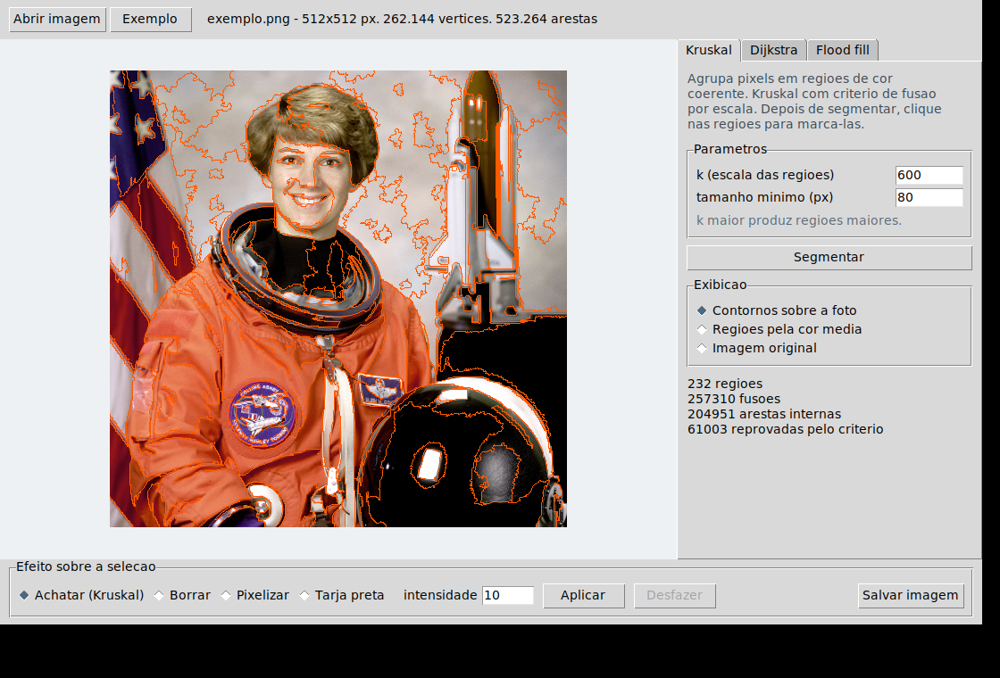
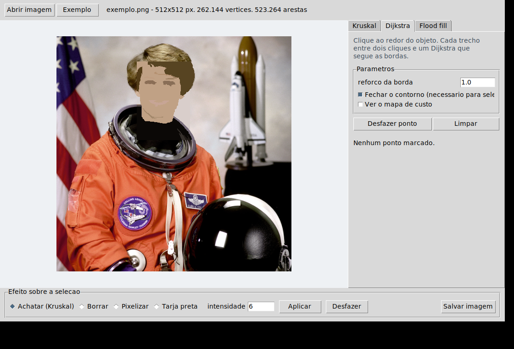
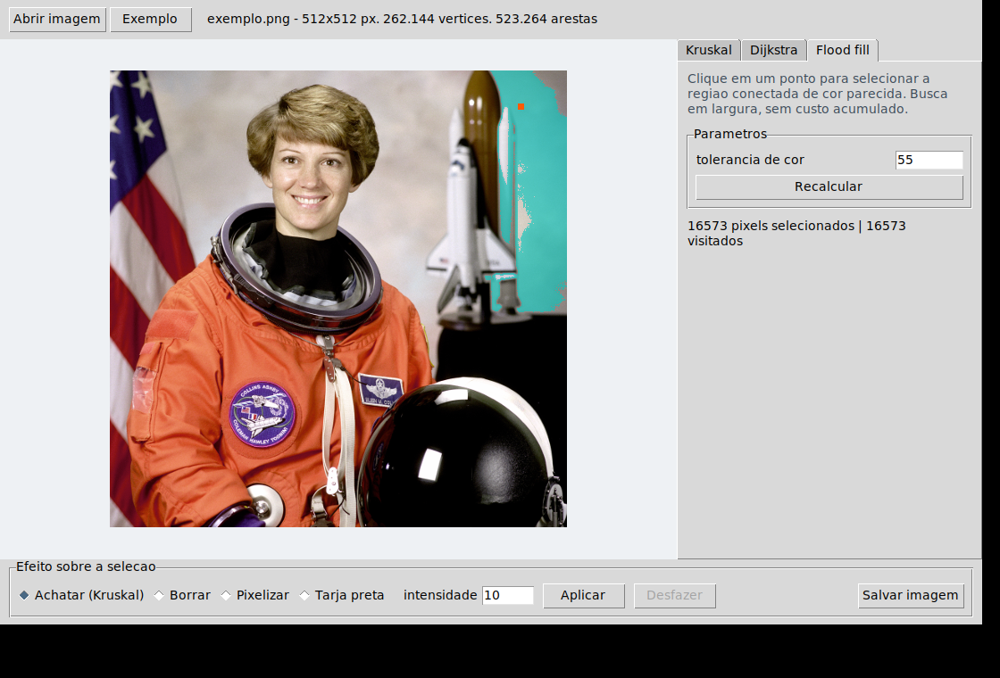
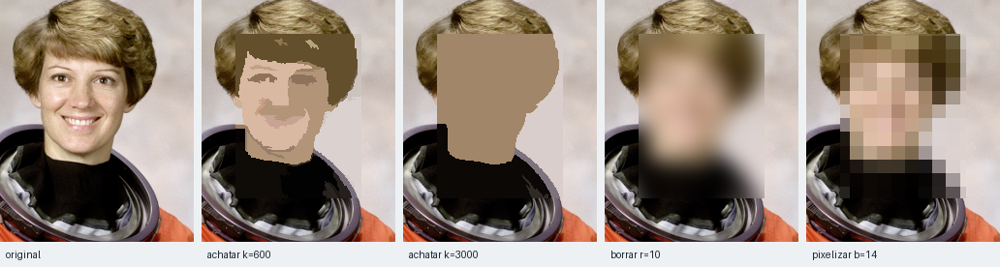

# Censura Inteligente de Imagens

**Conteúdo da Disciplina**: Grafos<br>

## Alunos

| Matrícula | Aluno |
| -- | -- |
|  |  |
|  |  |

## Sobre

Uma ferramenta de seleção e censura de imagens construída inteiramente sobre
algoritmos de grafos.

A ideia central é tratar a imagem como um **grafo em grade**: cada pixel é um
vértice, cada par de pixels vizinhos é uma aresta, e o peso da aresta é a
diferença de cor entre eles. Uma foto 512×512 vira um grafo de 262.144 vértices
e 523.264 arestas. Sobre essa mesma estrutura rodam os dois métodos do
trabalho, cada um resolvendo um problema real de edição de imagem:

| Método | Algoritmo | O que faz | Equivalente comercial |
| -- | -- | -- | -- |
| 1 | **Kruskal** | agrupa os pixels em regiões de cor coerente | segmentação automática |
| 2 | **Dijkstra** | traça o contorno de um objeto entre dois cliques | laço magnético / tesoura inteligente |
| extra | flood fill | seleciona a região conectada de cor parecida | varinha mágica |

**Como os três se encaixam.** Eles produzem coisas diferentes — o Kruskal
devolve rótulos, o Dijkstra devolve uma linha de pixels, o flood fill devolve
uma região — mas todos se reduzem a uma **máscara booleana** do tamanho da
imagem. O efeito escolhido é então aplicado só dentro dessa máscara, sem saber
qual algoritmo a produziu. É isso que faz o programa ser uma ferramenta única
em vez de três demonstrações soltas.

O flood fill ainda tem um segundo papel, funcional: é ele que **preenche o
interior do contorno traçado pelo Dijkstra**. O preenchimento é feito de forma
invertida — inunda tudo o que está *fora*, partindo das bordas da imagem e
tratando o contorno como parede; o que a inundação não alcançou é o interior.
Como não há comparação de cor nenhuma nesse passo, funciona mesmo quando o
interior é todo variado.

**Os efeitos** são quatro: achatar, borrar, pixelizar e tarjar. O primeiro é o
mais relevante para a disciplina, porque **é o próprio Kruskal usado como
efeito**: a área selecionada é segmentada e cada região é pintada com a sua cor
média. O resultado parece pintura, não mosaico. Como censura, tem vantagem
sobre o desfoque gaussiano — o desfoque é uma operação linear e pode ser
parcialmente revertido, enquanto aqui a informação dentro de cada região é
substituída por um único valor e não há o que reverter.

## Screenshots

**1. Kruskal — segmentação da imagem em regiões**
Os contornos em laranja são as fronteiras encontradas pelo algoritmo, usando
apenas a diferença de cor entre pixels vizinhos.



**2. Dijkstra + achatamento — o caso de uso de censura**
O contorno do rosto foi traçado com quatro cliques, o interior foi preenchido e
o efeito de achatamento por Kruskal foi aplicado apenas nessa área.



**3. Flood fill — seleção por região conectada**
Clique único seleciona a área contígua de cor parecida, respeitando a
tolerância informada.



**4. Comparação dos efeitos**
Da esquerda para a direita: original, achatamento com k baixo, achatamento com
k alto, desfoque gaussiano e mosaico. O achatamento preserva as formas e a
paleta; o mosaico impõe uma grade quadrada.



## Instalação

**Linguagem**: Python 3.10 ou superior<br>
**Framework**: nenhum. A interface usa Tkinter, que faz parte da biblioteca
padrão. As únicas dependências externas são NumPy (cálculo vetorizado dos pesos
das arestas) e Pillow (leitura e gravação de imagens).<br>

```bash
git clone <url-do-repositorio>
cd <pasta-do-repositorio>
pip install -r requirements.txt
python main.py
```

No Linux, se aparecer `ModuleNotFoundError: No module named 'tkinter'`:

```bash
sudo apt install python3-tk
```

Para rodar os testes:

```bash
python -m unittest discover -s tests -t tests -v
```

